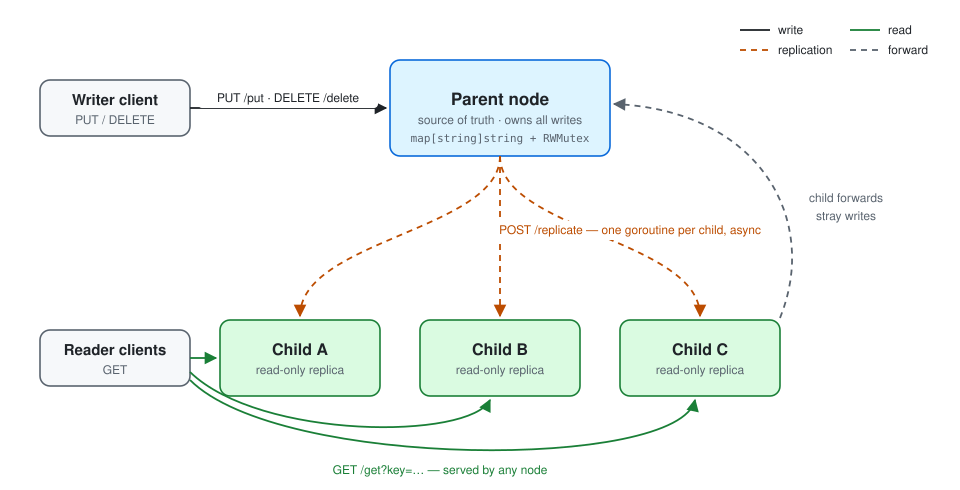
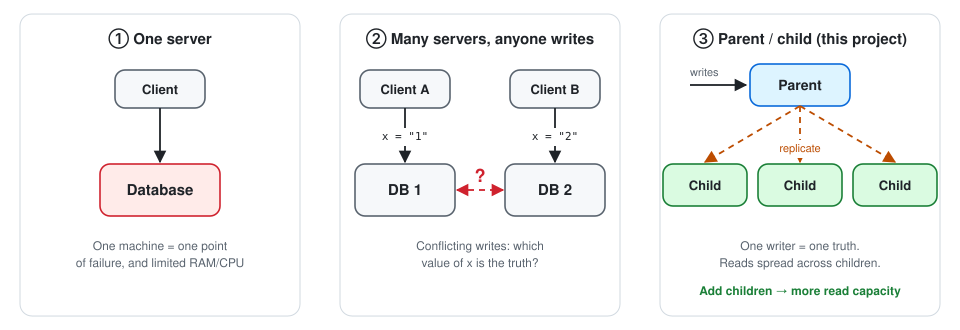
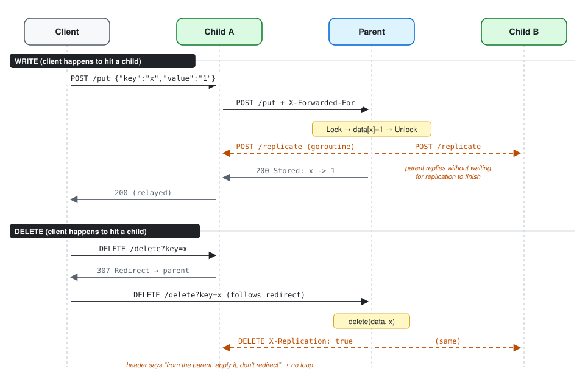
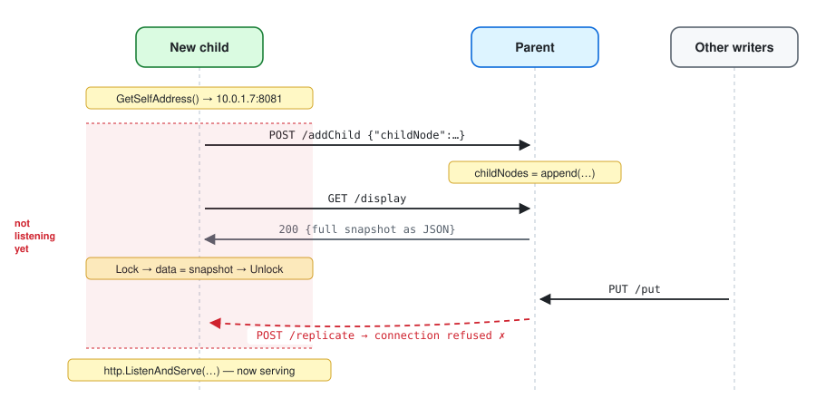
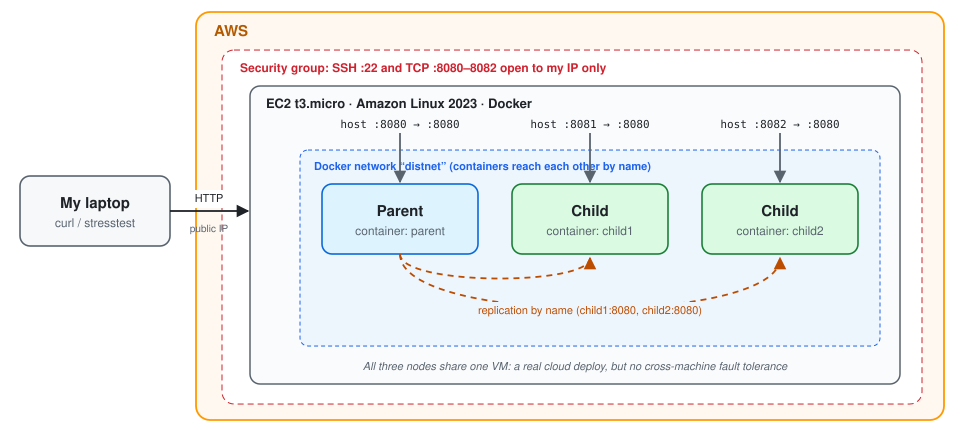

# Distributed-Database

Hello! I'm really interested in distributed systems, so I recently embarked on building a **Redis-like distributed key-value store** using Golang(Go) and deploying it on Amazon Web Services (AWS). I decided to use **single-leader replication**, where one parent owns every write, child nodes serve reads,and new children can join a running cluster and catch up automatically.

It uses only the Go standard library, ships as a Docker image, and runs live on AWS as a 3-node cluster of Docker containers on EC2.

<p align="center"></p>

## Why this design?

One database server has limited RAM and CPU, and if it dies, everything dies. Moreover, since around 80% of requests in typical applications are READ operations, separating READ and WRITE operations becomes crucial for optimizing performance.

So...
I designed my database to send every write to **one parent** (one source of truth, so no
conflicts) and spread reads across **many children** (add a child, get more read capacity).

<p align="center"></p>

This is the same pattern as PostgreSQL, MySQL, and Redis read replicas. The trade-offs:
the parent is a write bottleneck and a single point of failure, and because replication
is **asynchronous**, a child can briefly return stale data (**eventual consistency**).

## How it works

**Writes.** The parent stores the key under a write lock (`sync.RWMutex`). It then starts
**one goroutine per child** to `POST /replicate`, and replies without waiting for them.
If a client sends a write to a child, the child **forwards** it to the parent.

**Reads.** Any node answers `GET /get` from its local map under a _read_ lock, so many
reads can run at the same time.

**Deletes.** A child answers a client's delete with a **307 redirect** to the parent. The
parent then sends the delete to each child with an `X-Replication: true` header, which
means "this came from the parent: apply it, don't redirect it back."

<p align="center"></p>

**Joining.** A new child finds its own IP, registers with the parent (`/addChild`), then
pulls a full snapshot (`/display`). It registers _before_ syncing so that writes landing
in between still reach it.

<p align="center"></p>

The core of replication:

```go
func (n *Node) replicateToChildren(key, value string) {
	for _, childAddr := range n.childNodes {
		go func(addr string) { // one goroutine per child, fire-and-forget
			body, _ := json.Marshal(map[string]string{"key": key, "value": value})
			resp, err := http.Post("http://"+addr+"/replicate", "application/json", bytes.NewBuffer(body))
			if err != nil {
				log.Printf("Failed to replicate to %s: %v", addr, err)
				return
			}
			defer resp.Body.Close()
		}(childAddr)
	}
}
```

## Quick start

```bash
go run . -parent -port 8080                                                  # parent
PARENT_NODE=localhost:8080 SELF_ADDRESS=localhost:8081 go run . -port 8081   # child
PARENT_NODE=localhost:8080 SELF_ADDRESS=localhost:8082 go run . -port 8082   # child

curl -X POST localhost:8081/put -d '{"key":"name","value":"ben"}'   # write via a child (forwarded)
curl "localhost:8082/get?key=name"                                  # read from another child
curl -X DELETE "localhost:8080/delete?key=name"
curl localhost:8082/display                                         # dump a node's data
```

With Docker (containers find each other by name on a shared network):

```bash
docker build -t distdb . && docker network create distnet
docker run -d --name parent --network distnet -p 8080:8080 distdb -parent -port 8080
docker run -d --name child1 --network distnet -p 8081:8080 \
  -e PARENT_NODE=parent:8080 -e SELF_ADDRESS=child1:8080 distdb -port 8080
docker run -d --name child2 --network distnet -p 8082:8080 \
  -e PARENT_NODE=parent:8080 -e SELF_ADDRESS=child2:8080 distdb -port 8080
```

| Endpoint                                     | Purpose                            |
| -------------------------------------------- | ---------------------------------- |
| `GET /get?key=`                              | read (any node)                    |
| `POST /put`                                  | write (parent; children forward)   |
| `DELETE /delete?key=`                        | delete (parent; children redirect) |
| `GET /display`                               | dump the whole store as JSON       |
| `POST /replicate`, `/addChild`, `/setParent` | internal cluster traffic           |

## Deployment

The cluster runs on a single **EC2 t3.micro** (Amazon Linux 2023). On the instance, I
clone the repo, build the image with Docker, and start the three containers on a
`distnet` network, the same way as locally. Host ports 8080–8082 map to each container's
port 8080. The security group only allows SSH and ports 8080–8082 from my IP, so the
cluster isn't open to the internet.

<p align="center"></p>

## Results

Measured on a 3-node cluster (Linux, 2 vCPU, median of 3 runs):

| Metric | Result |
| --- | --- |
| Read latency (5 concurrent clients) | p50 **0.16 ms** · p99 **0.91 ms** |
| Write latency at parent (replicating to 2 children) | p50 **0.86 ms** · p99 **7.1 ms** · ~3,700 writes/s |
| Replication lag (parent ack → readable on child, 1,000 writes) | p50 **0.41 ms** · p99 **1.5 ms** · 0 lost |
| New-node catch-up, 10k keys (0.2 MB snapshot) | **25 ms** |
| New-node catch-up, 100k keys (2.3 MB snapshot) | **139 ms** |

All nodes ran on one machine, so replication lag here leaves out real network delay.
Across separate machines, add one network round trip.

## Known issues (found by testing)

- **Out-of-order replication.** Each write replicates in its own goroutine, so a child can
  apply two writes to the same key in the wrong order. After 300 concurrent writes to one
  key, the parent held `251` and a child held `256`.
- **Join-window loss.** A child registers and syncs _before_ its HTTP server starts
  listening, so writes replicated in that gap get "connection refused" and are lost. A
  child that joined during 400 writes ended with 399 keys.
- **Best-effort replication, no persistence, single parent.** Failed replications are
  never retried, data lives only in memory, and there is no failover. On AWS, all nodes
  also share one VM, so that machine failing takes down the whole cluster.

## Next steps

- [ ] **Persistence:** append-only log and snapshots on disk, so a node survives a restart
- [ ] **Health checks:** heartbeat children and drop dead ones from the replica set
- [ ] **Parent failover → consensus:** remove the single point of failure by electing a new
      parent with [Raft](https://raft.github.io/raft.pdf)
- [ ] **Sharding:** partition keys with consistent hashing to scale _writes_, not just reads
- [ ] **Tunable consistency:** quorum reads and writes (Dynamo-style `R + W > N`)
- [ ] **Real tests:** table-driven `httptest` unit tests and a race-detector run (`go test -race`)

## License

[MIT](LICENSE)
